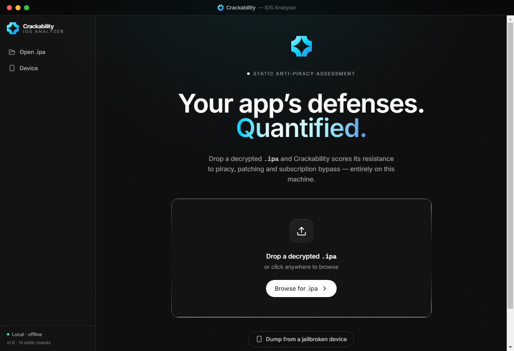
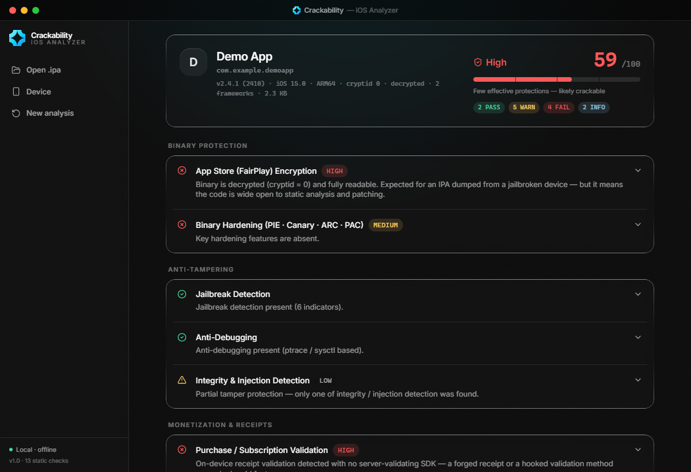
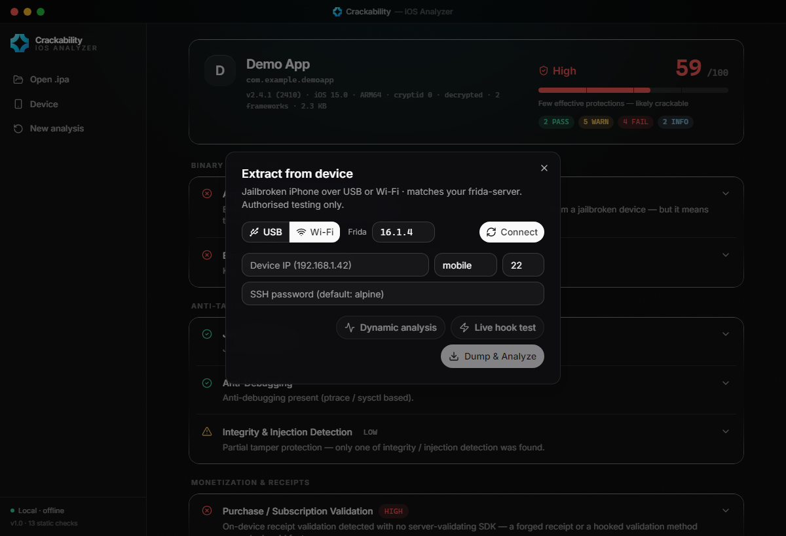

# iOS Crackability Analyzer

A static **security-assessment** tool for iOS apps. Point it at a decrypted
`.ipa` and it scores how resistant the app is to piracy, patching and
subscription bypass — and reports *why*, with concrete hardening guidance.

It's built for **authorized** work: developers hardening their own apps,
researchers assessing apps they're permitted to test, and writeups. It analyzes
and **reports** weaknesses — it does not unlock, patch, or forge anything.

> ⚠️ **Authorized use only.** Run against apps you own or are permitted to test.
> Use the findings to *harden* software, not to bypass paid functionality.

---

## Screenshots

> A desktop front-end (built on this engine) showing the assessment output.

| Start | Report | Device assessment |
|---|---|---|
|  |  |  |

---

## What it checks

| Category | Crackability signal |
|---|---|
| **FairPlay encryption** | `cryptid == 0` → binary decrypted & fully readable/patchable |
| **Binary hardening** | missing PIE / stack canary / ARC / PAC |
| **Jailbreak detection** | present = harder; absent = runs unmodified on JB devices |
| **Anti-debug** | `ptrace(PT_DENY_ATTACH)` / `sysctl` checks |
| **Anti-tamper / injection** | dyld image checks, code-signature checks, protector SDKs |
| **Receipt / subscription validation** | local-only (forgeable) vs server-validated (robust) |
| **Patchable premium / license flags** | boolean gates (`isPremium`, `isSubscribed`, …) detected & reported |
| **Hardcoded secrets** | API keys / tokens embedded in the binary (shown so owners can rotate) |
| **Weak crypto** | MD5 / SHA-1 / DES / RC4 / ECB |
| **ATS / entitlements / debug artifacts** | transport security, `get-task-allow`, leftover debug surface |

Each check yields a status (PASS / WARN / FAIL / INFO), evidence, a risk weight,
and remediation. The pipeline aggregates these into a **0–100 crackability
score** and a verdict band (low → critical).

## Install

```bash
python -m venv .venv
.venv\Scripts\activate          # Linux/macOS: source .venv/bin/activate
pip install -r requirements.txt
```

## Use

**CLI**
```bash
python main.py --cli /path/to/App.ipa --json report.json --html report.html
```

**MCP server** (read-only assessment for other tools / agents)
```bash
pip install mcp
python mcp_server.py            # stdio transport
```
Tools exposed:
- `analyze_ipa(ipa_path)` → full report (findings + score) as JSON
- `list_checks()` → the checks that run
- `scoring_guide()` → how the score maps to a verdict

The MCP server is an **assessor**: it only reads and reports. There are
deliberately no tools that unlock, flip flags, modify storage, or forge receipts.

See **[skills.md](skills.md)** for a step-by-step "how to conduct an assessment"
guide (for a human or an agent driving the MCP).

## How scoring works

`0` = well-protected, `100` = trivially crackable. A decrypted binary
(`cryptid == 0`) dominates the score, since it's open to static analysis and
patching. Money-critical decisions (premium/subscription) made **client-side** —
a local boolean or a locally-validated receipt — are the highest-value findings,
with the fix being **server-side validation + signed / remote entitlements**.

## Project layout

```
main.py                 CLI entry
mcp_server.py           read-only MCP assessment server
skills.md               how-to-assess guide
app/analyzer/           IPA loading, Mach-O parsing, strings, checks, scoring
app/report/             JSON + HTML export
tests/                  engine tests
```

## License

MIT — see [LICENSE](LICENSE).
